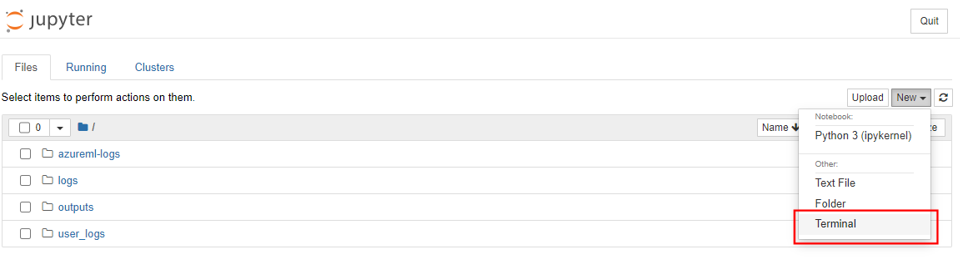
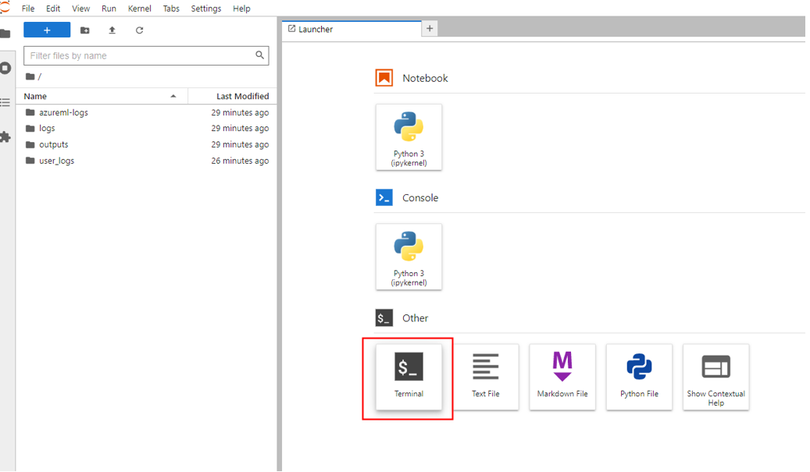

## Overview
ML model training usually requires lots of experimentation and iterations. With the new AzureML interactive job experience, data scientists can now use CLI v2 or AzureML Studio Portal to quickly reserve their required compute resources with custom environment, access the job container via different training applications including **Jupyter, JupyterLab, TensorBoard, and VS Code** (VS Code will be available in August) to iterate on training scripts, monitor the training progress or debug the job remotely like they usually do on their local machines.

Interactive training is supported on **AzureML Compute Cluster** and **Azure Arc-enabled Kubernetes Cluster**  and will be available on Compute Instance in later release.

## Prerequisites
- To use the CLI (v2), you must have an Azure subscription. If you don't have an Azure subscription, create a free account before you begin. Try the [free or paid version of Azure Machine Learning](https://azure.microsoft.com/free/) today.
- [Install and set up CLI (v2)](how-to-configure-cli.md).
- If you are under VNet, you must [enable outbound traffic](https://docs.microsoft.com/azure/machine-learning/how-to-access-azureml-behind-firewall?tabs=ipaddress%2Cpublic#outbound-configuration) for UDP 5831 to AzureMachineLearning in order to use this feature.

## Get started
### Submit an interactive job via CLI v2
1. Create a job yaml `job.yaml` with below sample content. Make sure to replace `your compute name` with your own value. If you want to use custom environment, follow the examples in [this tutorial](https://docs.microsoft.com/azure/machine-learning/how-to-manage-environments-v2) to create a custom environment. 
```dotnetcli
code: src 
command: 
  python train.py 
  sleep 1h # you can add other commands before "sleep 1h", the sleeping time can be put at the end so that the compute resource is reserved after the script finishes running.
environment: azureml:AzureML-tensorflow-2.4-ubuntu18.04-py37-cuda11-gpu:41
environment_variables: 
  AZUREML_COMMON_RUNTIME_USE_INTERACTIVE_CAPABILITY: 'True'
  AZUREML_COMPUTE_USE_COMMON_RUNTIME: 'True' 
compute: azureml:<your compute name>
services:
  "my_jupyter":
    job_service_type: "Jupyter" # Jupyter Notebook
  "my_tensorboard":
    job_service_type: "TensorBoard"
    properties:
      logDir: "~/tblog" # where you want to store the TensorBoard output 
  "my_jupyterlab":
    job_service_type: "JupyterLab"
```
Please make sure to set the environment variable `AZUREML_COMMON_RUNTIME_USE_INTERACTIVE_CAPABILITY: 'True'` and `AZUREML_COMPUTE_USE_COMMON_RUNTIME: 'True'`in order to enable the interactive capability in preview. The `services` section specifies the training applications you want to interact with.  
You can put `sleep <specific time>` at the end of the command to speicify the amount of time you want to reserve the compute resource. The format follows: 
* sleep 1s
* sleep 1m
* sleep 1h
* sleep 1d

You can also put `sleep infinity`. Note that if you put `sleep infinity`, you will need to cancel the job after you finish the work. We will work on an auto termination policy for this scenario in later release. 
 
2. Run command `az ml job create --file <path to your job yaml file> --workspace-name <your workspace name> --resource-group <your resource group name> --subscription <sub-id> `

### Submit an interactive job via AzureML studio portal
1. Create a new job from the left navigation pane in the studio portal.

1. Choose `Compute cluster` or `Attached compute` (Kubernetes) as the compute type, choose the compute target, and specify how many nodes you need in `Instance count`. Note that for distributed job, you can only access the head node in the current release.

1. Follow the wizard to choose the environment you want to start the job.
1. In `Job settings` step, add your training code (and input/output data) and reference it in your command to make sure it's mounted to your job. **You can end your command with `sleep <specific time>` to reserve the resource.** An example is like below:

1. Select the training applications you want to interact with in the job.

1. Review and create the job.


### Connect to endpoints
It might take a few minutes to start the job and applications specified. After the job is submitted and in **Running** state, you can connect to the applications by finding them from the job details page on the studio portal or directly from the CLI.
#### Connect via CLI v2
When the job is **running**, Run the command `az ml job show <your job name>` to get the URL to the applications. The endpoint URL will show under `services` in the output. Here is an example:


#### Connect via AzureML studio portal
1. You can connect to the applications by clicking the button **Access training applications** in the job details page. 


Clicking the applications in the panel opens a new tab for the applications. Please note that you can access the applications only when the applications is in **Running** status and only the **job owner** is authorized to access the applications.


### Interact with the applications
1. You are landed in the user container under your working directory, where you can access your code, inputs, outputs, and logs. You can open a terminal from Jupyter Notebook or Jupyter Lab and start interacting within the job container. You can also directly iterate your training script with Jupyter Notebook or Jupyter Lab. 


1. If you have logged tensorflow events for your job, you can use TensorBoard to monitor the metrics when your job is running.
1. If you run into any issues while connecting to the applications, the interactive capability and applications logs can be found from **system_logs->interactive_capability** under **Outputs + logs** tab.


### Release the compute resource
1. Once you are done with the interactive training, you can also go to the job details page to cancel the job. This will release the compute resource. Alternatively, use `az ml job cancel -n <your job name>` in the CLI. 


## Contact us
Reach out to us: interactivetraining@service.microsoft.com if you have any questions or feedback.
