# [Public Preview] Customizable job metrics experience

## Overview 

New enhancements have been made to the metrics tab of a job to help you better understand your experimentation results. The new capabilities include the ability to create custom charts, rearrange the layout, save the personalized views, and then share them with your teammates.

## How to use the feature

1. Navigate to the <a href="https://ml.azure.com/" target="_blank">Azure ML Studio UI</a>. Then, on the top-right, click to open the `Manage preview features` panel and ensure that the `Customizable job metrics experience` feature is enabled.

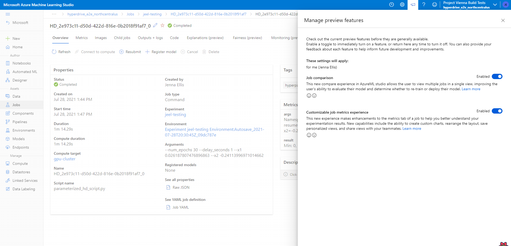

2. Navigate to the job details view of any job with metrics logged and click on the `Metrics` pivot.

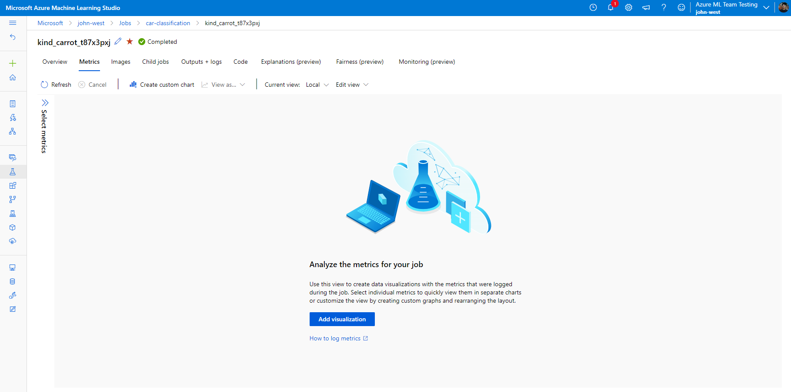

3. Select the metrics that you would like to include in the view.

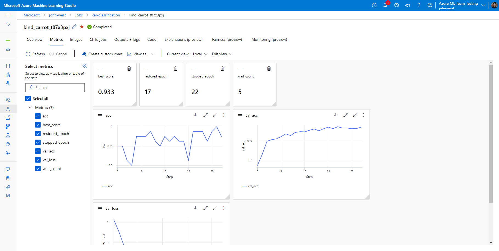

4. Rearrange the view to your preference by dragging and resizing the charts.

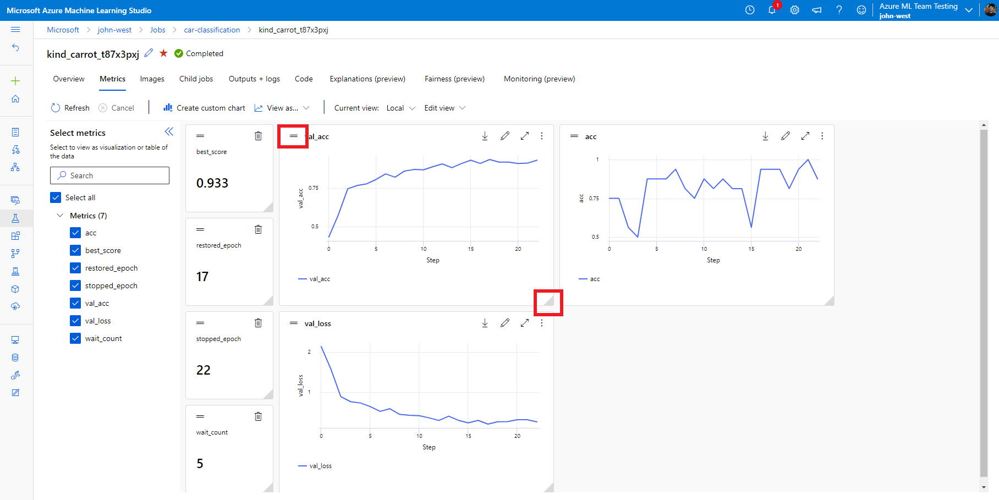

5. Click on the `Create custom chart` button to create a new chart.

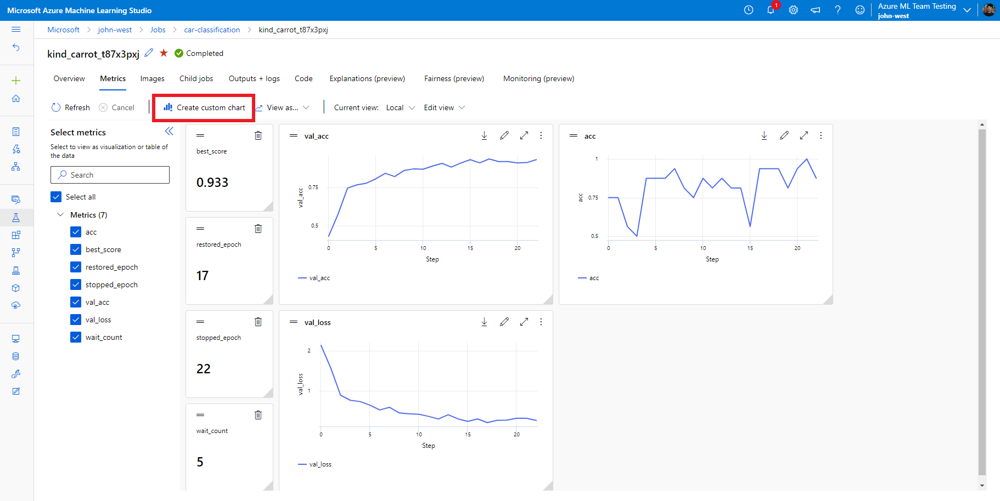

6. Customize the chart data however you would like by configuring the chart title, chart type, axis labels, axis scales, metrics, smoothing, or error bars.

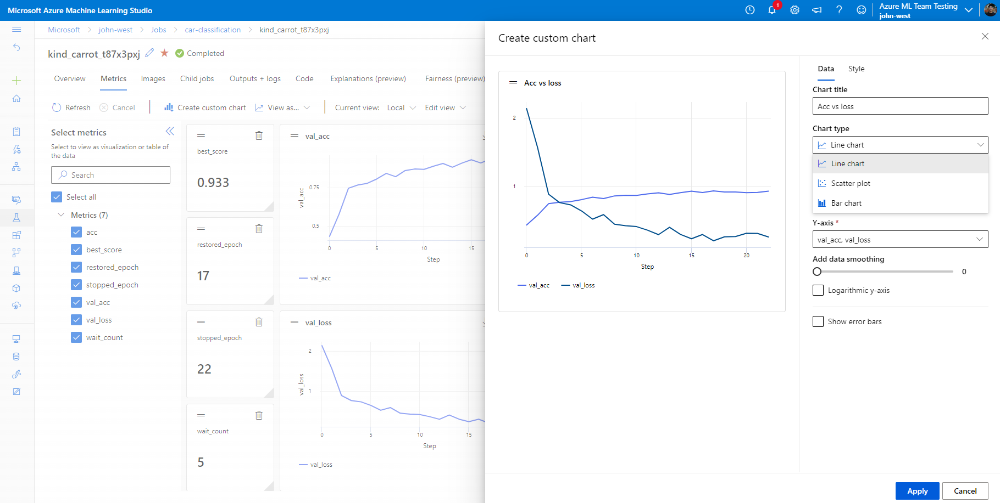

7. Customize the style of the lines by changing the color or line type.

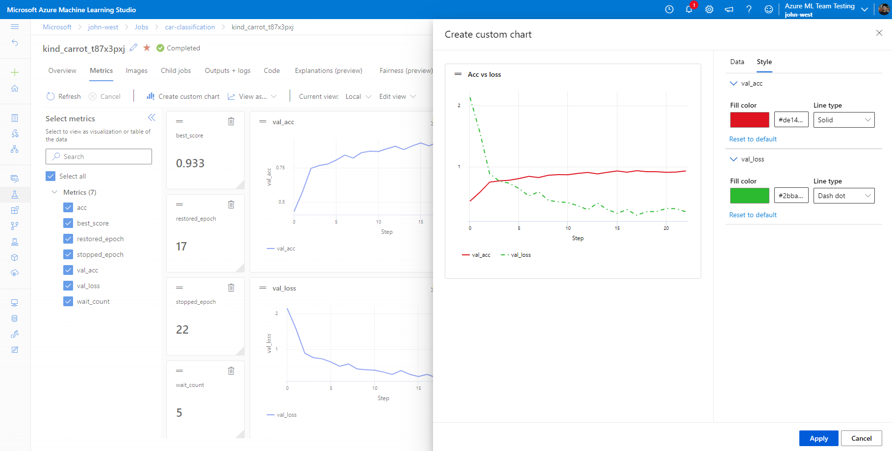

8. When you have the view that you want, clone it as a custom view for the workspace.

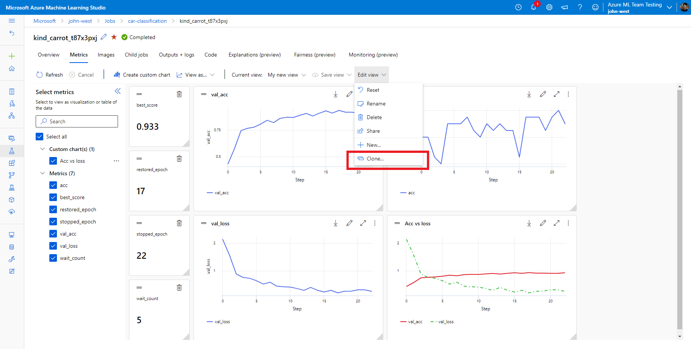
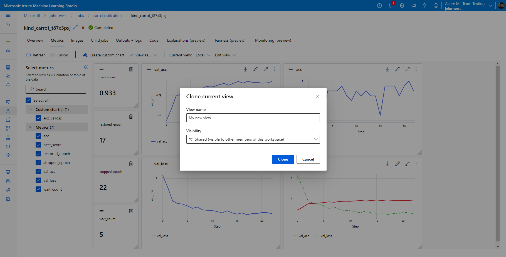

9. For easier sharing, use the share view button to copy a direct URL to your view.

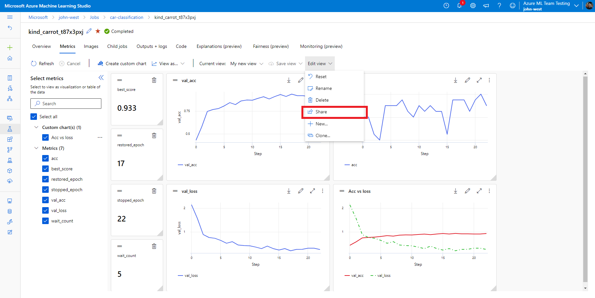
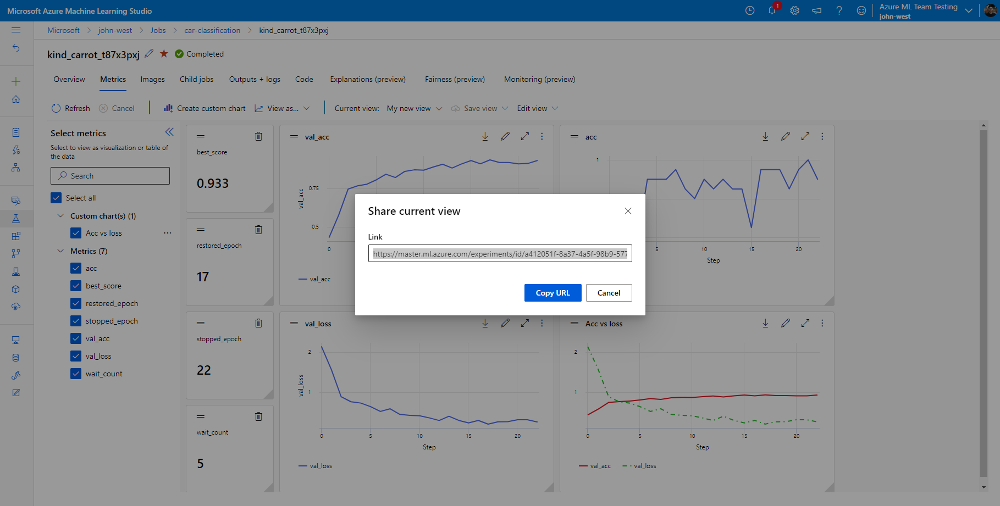

## How to submit feedback

To submit feedback, please use the built-in feedback tool in the Azure ML Studio UI.

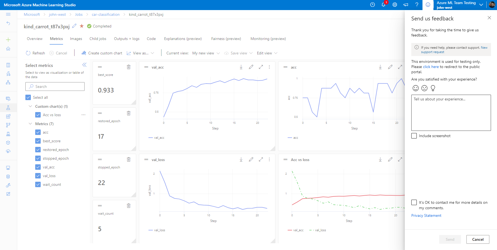

