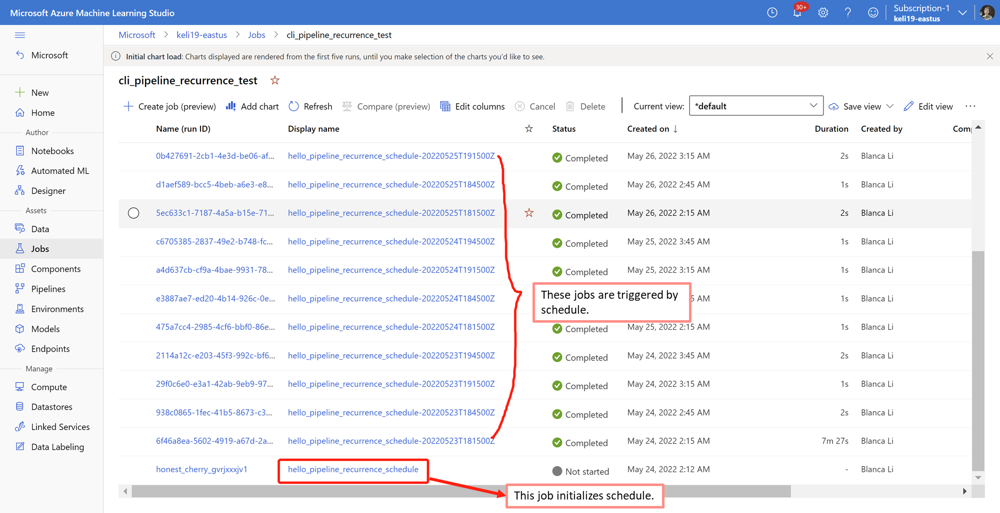
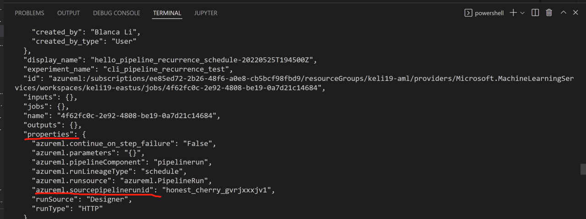

# Schedule Azure Machine Learning pipelines (preview)

In this article, you'll learn how to schedule Azure Machine Learning pipelines using CLI v2 and Python SDK v2. You can create a time-based schedule either using crontab expression or recurrence time settings. Time-based schedules can be used to take care of routine tasks, such as regular retraining or batch predictions. After learning how to create schedules, you'll learn how to retrieve and disable them. 

* [Use CLI v2 to create schedules](#Use-CLI-v2-to-schedule-a-pipeline-job)

* [Use Python SDK v2 to create schedules](#use-python-sdk-v2-to-schedule-a-pipeline-job)

> [!NOTE]
> Schedule is in **private preview**. Please set `AZURE_ML_CLI_PRIVATE_FEATURES_ENABLED=TRUE`.


## Prerequisites

* An Azure account with an active subscription - [Create an account for free](https://azure.microsoft.com/free/?WT.mc_id=A261C142F)

* An Azure ML workspace with computer cluster - [Configure workspace](https://github.com/Azure/azureml-examples/blob/sdk-preview/sdk/jobs/configuration.ipynb)

* [Install and set up the Azure CLI extension for Machine Learning](how-to-configure-cli.md)

* [Install Azure Machine Learning Python SDK v2 (preview)](https://github.com/Azure/azureml-examples/blob/sdk-preview/sdk/setup.sh)

* Clone the examples repository:

    ```azurecli-interactive
    git clone https://github.com/Azure/azureml-examples --depth 1
    cd azureml-examples/cli/jobs/pipelines-with-components/
    ```

> [!IMPORTANT]
> This article assumes you have basic understanding of how to use Azure Machine Learning CLI v2 or SDK v2 to create Azure Machine Learning pipelines.
> See samples of [how to use CLI v2 to create pipelines](https://github.com/Azure/azureml-examples/tree/sdk-preview/cli/jobs/pipelines-with-components/basics) and [how to use SDK v2 to create pipelines](https://github.com/Azure/azureml-examples/tree/sdk-preview/sdk/jobs/pipelines)

## Use CLI v2 to schedule a pipeline job

In this section, you'll learn how to create a time-based schedule for a pipeline job using CLI v2.

> [!NOTE]
> Schedule can be defined only at the pipeline job level. If any job inside the pipeline has a schedule defined, the pipeline job creation will fail.

### Create cron schedule

This section will show how to create a cron schedule based on standard crontab expression for a pipeline job. You can find the [sample pipeline yaml file](https://github.com/Azure/azureml-examples/tree/sdk-preview/cli/jobs/pipelines-with-components/basics/hello-pipeline-cron-schedule.yml) in the examples repository.

The following sample shows a pipeline job is scheduled to be triggered at 16:15PM every Monday in Eastern Standard Time (UTC-4). And the status of `schedule` is disabled, which means the sheduled jobs will not be triggered.

```YAML
$schema: https://azuremlschemas.azureedge.net/latest/pipelineJob.schema.json
type: pipeline
display_name: hello_pipeline_cron_schedule
experiment_name: cli_cron_schedule
description: Pipeline with cron schedule
schedule:
  type: cron
  expression: "15 16 * * 1"
  start_time: "2022-05-10T10:15:00-04:00" # start time with timezone
  time_zone: Eastern Standard Time # time zone of expression
  status: disabled # change to 'enabled' if start schedule
jobs:
  hello_job:
    command: echo "hello"
    environment: azureml:AzureML-sklearn-0.24-ubuntu18.04-py37-cpu@latest
    compute: azureml:cpu-cluster
  world_job:
    command: echo "world"
    environment: azureml:AzureML-sklearn-0.24-ubuntu18.04-py37-cpu@latest
    compute: azureml:cpu-cluster
```

The `schedule` section defines the schedule details and contains following properties:

- **(Required)** `type` specifies the schedule type is `cron`. It can also be `recurrence`, see details in the next section.
- **(Required)** `expression` uses standard crontab expression to express a recurring schedule. A single expression is composed of 5 space-delimited fields:

    `MINUTES HOURS DAYS MONTHS DAYS-OF-WEEK`

    - A single wildcard (`*`), which covers all values for the field. So a `*` in days means all days of a month (which varies with month and year).
    - The `expression: "15 16 * * 1"` in the sample above means the 16:15PM on every Monday.
    - The table below lists the valid values for each field:
 
        | Field          |   Range  | Comment                                                   |
        |----------------|----------|-----------------------------------------------------------|
        | `MINUTES`      |    0-59  | -                                                         |
        | `HOURS`        |    0-23  | -                                                         |
        | `DAYS`         |    -  |    Not supported. The value will be ignored and treat as `*`.    |
        | `MONTHS`       |    -  | Not supported. The value will be ignored and treat as `*`.        |
        | `DAYS-OF-WEEK` |    0-6   | Where zero (0) means Sunday. Names of days also accepted. |

    - See more details about [how to use crontab expression](https://github.com/atifaziz/NCrontab/wiki/Crontab-Expression).

    > [!IMPORTANT]
    > `DAYS` and `MONTH` are not supported for now. If you pass a value, it will be ignored and treat as `*`.

- (Optional) `start_time` specifies the start date and time with timezone of the schedule. `start_time: "2022-05-10T10:15:00-04:00"` means the schedule starts from 10:15:00AM on 2022-05-10 in UTC-4 timezone. If `start_time` is omitted, the first job will run instantly and the future jobs will run based on the schedule. If the start time is in the past, the first job will run at the next calculated run time.

- (Optional) `time_zone`specifies the time zone of the expression. If omitted, by default is UTC. See [appendix for timezone values](#appendix).

- (Optional) `status` can be `enabled` meaning the schedule will trigger jobs as defined or `disabled` meaning the schedule is created but not triggered any job. If omitted, by default is `enabled`.

### Create recurrence schedule

This section will show how to create a recurrence schedule for a pipeline job. You can find the sample [recurrence scheduled pipeline yaml file](https://github.com/Azure/azureml-examples/tree/sdk-preview/cli/jobs/pipelines-with-components/basics/hello-pipeline-recurrence-schedule.yml) in the examples repository.

The following sample shows a pipeline job is scheduled to be triggered at the 15th, 0th, and 30th minutes of the 10th, 11th, 12th hour of every Monday, Wednesday and Friday, starts from 2022-05-10T10:15:00 in Pacific Standard Time (UTC-7). And the status of `schedule` is disabled.

```YAML
$schema: https://azuremlschemas.azureedge.net/latest/pipelineJob.schema.json
type: pipeline
display_name: hello_pipeline_recurrence_schedule
description:  Pipeline with recurrence schedule
schedule:
  type: recurrence
  frequency: week # can be minute, hour, day, week, month
  interval: 1 # every week
  start_time: "2022-05-10T10:15:00-07:00" # start time with timezone
  pattern:
    hours: [ 10, 11, 12 ]
    minutes: [ 15, 0, 30 ]
    weekdays: [ monday, wednesday, friday ]
  time_zone: Pacific Standard Time # time zone of pattern
  status: disabled # change to 'enabled' if start schedule
jobs:
  hello_job:
    command: echo "hello"
    environment: azureml:AzureML-sklearn-0.24-ubuntu18.04-py37-cpu@latest
    compute: azureml:cpu-cluster
  world_job:
    command: echo "world"
    environment: azureml:AzureML-sklearn-0.24-ubuntu18.04-py37-cpu@latest
    compute: azureml:cpu-cluster
```

The `schedule` section contains following properties:

- **(Required)** `type` specifies the schedule type is `recurrence`.

- **(Required)** `frequency` specifies he unit of time that describes how often the schedule fires. Can be `minute`, `hour`, `day`, `week`, `month`.
  
- **(Required)** `interval`specifies how often the schedule fires based on the frequency, which is the number of time units to wait until the schedule fires again.
  
- (Optional) `start_time` describes the start date and time with timezone. If `start_time` is omitted, the first job will run instantly and the future jobs will be triggered based on the schedule, saying start_time will be equal to the job created time. If the start time is in the past, the first job will run at the next calculated run time. 

- (Optional) `pattern` defines the recurrence pattern, containing `hours`, `minutes`, and `weekdays`. 
    - When `frequency` is `day`, pattern can specify `hours` and `minutes`.
    - When `frequency` is `week` and `month`, pattern can specify `hours`, `minutes` and `weekdays`.
    - `hours` should be an integer or a list, from 0 to 23.
    - `minutes` should be an integer or a list, from 0 to 59.
    - `weekdays` can be a string or list from `monday` to `sunday`.
    - If `pattern` is omitted, the job(s) will be triggered according to the logic of `start_time`, `frequecy` and `interval`.

- (Optional) `time_zone` specifies the time zone of the recurrence. If omitted, by default is UTC. See [appendix for timezone values]

- (Optional) `status` can be `enabled` meaning the schedule will trigger jobs as defined or `disabled` meaning the schedule is created but not triggered any job. If omitted, by default is `enabled`.

### Create a pipeline job initilizing the schedule

Use `az ml job create --file hello-pipeline-cron-schedule.yml` to create a job with `schedule` property. This will create a job that initilizes the schedule. The status of this job will always be `Not Started`. 

Then the scheduled job(s) will be triggered according to the schedule definition of this job yaml file. The triggered jobs will be under the same experiment as the initial job with schedule.

Jobs triggered by the schedule will be in the same experiment as the job initilizing schedule, and will have display name like `hello_pipeline_cron_schedule-20210101T060000Z`, the suffix of which indicates the triggered time.



### Manage scheduled job

In this setion, you'll learn how to monitor and manage your scheduled jobs using CLI.

- List scheduled jobs

    To list jobs that initially defined a schedule, use `az ml job list --schedule-defined`
 
    To list jobs triggered by one schedule, use `az ml job list --scheduled-job-name {job_name}`. `{job_name}` is name of a job that initially defined a schedule. All jobs that were triggered by this job's schedule will be listed.

- Show the source pipeline
    Use `az ml job show -n {job_name}` to show the source pipeline job id of the job with `{job_name}`. The source pipeline job defines the schedule which triggeres the current job. 

    

- Update job schedule

    To update a job schedule, you can update the job yaml with `schedule` section in it, and use `az ml job create --file updated_job.yml --name {job_name}`. `{job_name}` is the job with schedule which you've created.

- Disable/Enable job schedule

    Disable/Enable a schedule is part of updating job schedule above. You can change the `status` of `schedule` in the job yaml, and then use `az ml job create --file updated_job.yml --name {job_name}` to update.

## Use Python SDK v2 to schedule a pipeline job

In this section, you'll learn how to create a time-based schedule for a pipeline job using Python SDK v2. You can find [sample notebook](https://github.com/Azure/azureml-examples/blob/may-sdk-preview/sdk/jobs/pipelines/1f_pipeline_using_schedule/pipeline_using_schedule.ipynb) in the examples repo.

First is to import libraries to create pipelines and schedules:

```Python
# Import required libraries
from datetime import datetime
from dateutil import tz

from azure.ai.ml import MLClient, Input, load_component
from azure.ai.ml.dsl import pipeline
from azure.ai.ml.constants import TimeZone
from azure.ai.ml.entities import (
    CronSchedule,
    RecurrenceSchedule,
    RecurrencePattern,
    ScheduleStatus,
)
```

Suppose you've defined a `pipeline_job` like following, and we will create schedule for it in the following sections.

```Python
@pipeline(
    default_compute="cpu-cluster",
    description="E2E dummy train-score-eval pipeline using schedule",
)
def pipeline_using_schedule(
    training_input,
    test_input,
    training_max_epochs=20,
    training_learning_rate=1.8,
    learning_rate_schedule="time-based",
):
    # Call component obj as function: apply given inputs & parameters to create a node in pipeline
    train_with_sample_data = train_model(
        training_data=training_input,
        max_epochs=training_max_epochs,
        learning_rate=training_learning_rate,
        learning_rate_schedule=learning_rate_schedule,
    )

    score_with_sample_data = score_data(
        model_input=train_with_sample_data.outputs.model_output, test_data=test_input
    )
    score_with_sample_data.outputs.score_output.mode = "upload"

    eval_with_sample_data = eval_model(
        scoring_result=score_with_sample_data.outputs.score_output
    )

    # Return: pipeline outputs
    return {
        "trained_model": train_with_sample_data.outputs.model_output,
        "scored_data": score_with_sample_data.outputs.score_output,
        "evaluation_report": eval_with_sample_data.outputs.eval_output,
    }

pipeline_job = pipeline_using_schedule(
    training_input=Input(type="uri_folder", path=parent_dir + "/data/"),
    test_input=Input(type="uri_folder", path=parent_dir + "/data/"),
    training_max_epochs=20,
    training_learning_rate=1.8,
    learning_rate_schedule="time-based",
)
```

### Define cron schedule

```Python
# create a cron schedule start from current time and fire at minute 0,10 of every hour with PACIFIC STANDARD TIME timezone
schedule_start_time = datetime.now(tz=tz.gettz("PACIFIC STANDARD TIME"))
cron_schedule = CronSchedule(
    expression="0,10 * * * *",
    start_time=schedule_start_time,
    time_zone=TimeZone.PACIFIC_STANDARD_TIME,
    status=ScheduleStatus.ENABLED,
)
pipeline_job.schedule = cron_schedule
```

The `CronSchedule` constructor defines the cron schedule details and contains following arguments:

- **(Required)** `expression` uses standard crontab expression to express a recurring schedule. A single expression is composed of 5 space-delimited fields:

    `MINUTES HOURS DAYS MONTHS DAYS-OF-WEEK`

    - A single wildcard (`*`), which covers all values for the field. So a `*` in days means all days of a month (which varies with month and year).
    - The `expression: "15 16 * * 1"` in the sample above means the 16:15PM on every Monday.
    - The table below lists the valid values for each field:
 
        | Field          |   Range  | Comment                                                   |
        |----------------|----------|-----------------------------------------------------------|
        | `MINUTES`      |    0-59  | -                                                         |
        | `HOURS`        |    0-23  | -                                                         |
        | `DAYS`         |    -  |    Not supported. The value will be ignored and treat as `*`.    |
        | `MONTHS`       |    -  | Not supported. The value will be ignored and treat as `*`.        |
        | `DAYS-OF-WEEK` |    0-6   | Where zero (0) means Sunday. Names of days also accepted. |

    - See more details about [how to use crontab expression](https://github.com/atifaziz/NCrontab/wiki/Crontab-Expression).

    > [!IMPORTANT]
    > `DAYS` and `MONTH` are not supported for now. If you pass a value, it will be ignored and treat as `*`.

- (Optional) `start_time` specifies the start date and time with timezone of the schedule. `start_time: "2022-05-10T10:15:00-04:00"` means the schedule starts from 10:15:00AM on 2022-05-10 in UTC-4 timezone. If `start_time` is omitted, the first job will run instantly and the future jobs will run based on the schedule. If the start time is in the past, the first job will run at the next calculated run time.

- (Optional) `time_zone`specifies the time zone of the expression. If omitted, by default is UTC. See [appendix for timezone values](#appendix).

- (Optional) `status` can be `ENABLED` meaning the schedule will trigger jobs as defined or `DISABLED` meaning the schedule is created but not triggered any job. If omitted, by default is `ENABLED`.


### Define recurrence schedule

```Python
# create a recurrence schedule fire at 10:00 AM and 10:01 AM with UTC timezone every day
schedule_start_time = datetime.now(tz=tz.tzutc())
recurrence_schedule = RecurrenceSchedule(
    frequency="day",
    interval=1,
    pattern=RecurrencePattern(hours=10, minutes=[0, 1]),
    start_time=schedule_start_time,
    time_zone=TimeZone.UTC,
    status=ScheduleStatus.ENABLED
)
pipeline_job.schedule = recurrence_schedule
```

The `RecurrenceSchedule` constructor defines the recurrence schedule details and contains following arguments:

- **(Required)** `frequency` specifies he unit of time that describes how often the schedule fires. Can be `minute`, `hour`, `day`, `week`, `month`.
  
- **(Required)** `interval`specifies how often the schedule fires based on the frequency, which is the number of time units to wait until the schedule fires again.
  
- (Optional) `start_time` describes the start date and time with timezone. If `start_time` is omitted, the first job will run instantly and the future jobs will be triggered based on the schedule, saying start_time will be equal to the job created time. If the start time is in the past, the first job will run at the next calculated run time. 

- (Optional) `pattern` defines the recurrence pattern, containing `hours`, `minutes`, and `weekdays`. 
    - When `frequency` is `day`, pattern can specify `hours` and `minutes`.
    - When `frequency` is `week` and `month`, pattern can specify `hours`, `minutes` and `weekdays`.
    - `hours` should be an integer or a list, from 0 to 23.
    - `minutes` should be an integer or a list, from 0 to 59.
    - `weekdays` can be a string or list from `monday` to `sunday`.
    - If `pattern` is omitted, the job(s) will be triggered according to the logic of `start_time`, `frequecy` and `interval`.

- (Optional) `time_zone` specifies the time zone of the recurrence. If omitted, by default is UTC. See [appendix for timezone values].

- (Optional) `status` can be `ENABLED` meaning the schedule will trigger jobs as defined or `DISABLED` meaning the schedule is created but not triggered any job. If omitted, by default is `ENABLED`.

### Create a pipeline job initilizing the schedule

Use `ml_client.jobs.create_or_update()` to create a pipeline job which initilizes the schedule. Following is an example:

```Python
# submit job to workspace
pipeline_job_recurrence = ml_client.jobs.create_or_update(
    pipeline_job_recurrence, experiment_name="pipeline_schedule_recurrence",
    description="recurrence schedule"
)
pipeline_job_recurrence
```

### Manage scheduled job

In this setion, you'll learn how to monitor and manage your scheduled jobs using Python SDK.

- List scheduled jobs

    To list all jobs that initially defined a schedule, use the following code:
    
    ```Python
    for job in ml_client.jobs.list(schedule_defined=True):
    print(job)
    ```
 
    To list jobs triggered by one schedule, use the following code:
    ```Python
    for job in ml_client.jobs.list(scheduled_job_name={job_name}):
    print(job)
    ```
    {job_name}` is name of a job that initially defined a schedule. All jobs that were triggered by this schedule will be listed.

- Show the source pipeline
    
    ```Python
    print(ml_client.jobs.get(name="job_name"))
    ```

    You can find `azureml.sourcepipelinerunid` in the output.

- Update/Disable/Enable job schedule

     ```Python
    # get an existing job with name
    existing_job = ml_client.jobs.get(name=pipeline_job.name)
    # change schedule status to disable
    existing_job.schedule.status = ScheduleStatus.DISABLED
    ml_client.jobs.create_or_update(existing_job, experiment_name=existing_job.experiment_name)
    ```

## Appendix

### Timezone

Current schedule supports following timezones. The key (left to `=`) can be used directly in Python SDK, while the value (right to `=`) can be used in job YAML.

    DATELINE_STANDARD_TIME = "Dateline Standard Time"
    UTC_11 = "UTC-11"
    ALEUTIAN_STANDARD_TIME = "Aleutian Standard Time"
    HAWAIIAN_STANDARD_TIME = "Hawaiian Standard Time"
    MARQUESAS_STANDARD_TIME = "Marquesas Standard Time"
    ALASKAN_STANDARD_TIME = "Alaskan Standard Time"
    UTC_09 = "UTC-09"
    PACIFIC_STANDARD_TIME_MEXICO = "Pacific Standard Time (Mexico)"
    UTC_08 = "UTC-08"
    PACIFIC_STANDARD_TIME = "Pacific Standard Time"
    US_MOUNTAIN_STANDARD_TIME = "US Mountain Standard Time"
    MOUNTAIN_STANDARD_TIME_MEXICO = "Mountain Standard Time (Mexico)"
    MOUNTAIN_STANDARD_TIME = "Mountain Standard Time"
    CENTRAL_AMERICA_STANDARD_TIME = "Central America Standard Time"
    CENTRAL_STANDARD_TIME = "Central Standard Time"
    EASTER_ISLAND_STANDARD_TIME = "Easter Island Standard Time"
    CENTRAL_STANDARD_TIME_MEXICO = "Central Standard Time (Mexico)"
    CANADA_CENTRAL_STANDARD_TIME = "Canada Central Standard Time"
    SA_PACIFIC_STANDARD_TIME = "SA Pacific Standard Time"
    EASTERN_STANDARD_TIME_MEXICO = "Eastern Standard Time (Mexico)"
    EASTERN_STANDARD_TIME = "Eastern Standard Time"
    HAITI_STANDARD_TIME = "Haiti Standard Time"
    CUBA_STANDARD_TIME = "Cuba Standard Time"
    US_EASTERN_STANDARD_TIME = "US Eastern Standard Time"
    PARAGUAY_STANDARD_TIME = "Paraguay Standard Time"
    ATLANTIC_STANDARD_TIME = "Atlantic Standard Time"
    VenezuelaStandardTime = "Venezuela Standard Time"
    CENTRAL_BRAZILIAN_STANDARD_TIME = "Central Brazilian Standard Time"
    SA_WESTERN_STANDARD_TIME = "SA Western Standard Time"
    PACIFIC_SA_STANDARD_TIME = "Pacific SA Standard Time"
    TURKS_AND_CAICOS_STANDARD_TIME = "Turks And Caicos Standard Time"
    NEWFOUNDLAND_STANDARD_TIME = "Newfoundland Standard Time"
    TOCANTINS_STANDARD_TIME = "Tocantins Standard Time"
    E_SOUTH_AMERICAN_STANDARD_TIME = "E. South America Standard Time"
    SA_EASTERN_STANDARD_TIME = "SA Eastern Standard Time"
    ARGENTINA_STANDARD_TIME = "Argentina Standard Time"
    GREENLAND_STANDARD_TIME = "Greenland Standard Time"
    MONTEVIDEO_STANDARD_TIME = "Montevideo Standard Time"
    SAINT_PIERRE_STANDARD_TIME = "Saint Pierre Standard Time"
    BAHIA_STANDARD_TIME = "Bahia Standard Time"
    UTC_02 = "UTC-02"
    MID_ATLANTIC_STANDARD_TIME = "Mid-Atlantic Standard Time"
    AZORES_STANDARD_TIME = "Azores Standard Time"
    CAPE_VERDE_STANDARD_TIME = "Cape Verde Standard Time"
    UTC = "UTC"
    MOROCCO_STANDARD_TIME = "Morocco Standard Time"
    GMT_STANDARD_TIME = "GMT Standard Time"
    GREENWICH_STANDARD_TIME = "Greenwich Standard Time"
    W_EUROPE_STANDARD_TIME = "W. Europe Standard Time"
    CENTRAL_EUROPE_STANDARD_TIME = "Central Europe Standard Time"
    ROMANCE_STANDARD_TIME = "Romance Standard Time"
    CENTRAL_EUROPEAN_STANDARD_TIME = "Central European Standard Time"
    W_CENTEAL_AFRICA_STANDARD_TIME = "W. Central Africa Standard Time"
    NAMIBIA_STANDARD_TIME = "Namibia Standard Time"
    JORDAN_STANDARD_TIME = "Jordan Standard Time"
    GTB_STANDARD_TIME = "GTB Standard Time"
    MIDDLE_EAST_STANDARD_TIME = "Middle East Standard Time"
    EGYPT_STANDARD_TIME = "Egypt Standard Time"
    E_EUROPE_STANDARD_TIME = "E. Europe Standard Time"
    SYRIA_STANDARD_TIME = "Syria Standard Time"
    WEST_BANK_STANDARD_TIME = "West Bank Standard Time"
    SOUTH_AFRICA_STANDARD_TIME = "South Africa Standard Time"
    FLE_STANDARD_TIME = "FLE Standard Time"
    TURKEY_STANDARD_TIME = "Turkey Standard Time"
    ISRAEL_STANDARD_TIME = "Israel Standard Time"
    KALININGRAD_STANDARD_TIME = "Kaliningrad Standard Time"
    LIBYA_STANDARD_TIME = "Libya Standard Time"
    ARABIC_STANDARD_TIME = "Arabic Standard Time"
    ARAB_STANDARD_TIME = "Arab Standard Time"
    BELARUS_STANDARD_TIME = "Belarus Standard Time"
    RUSSIAN_STANDARD_TIME = "Russian Standard Time"
    E_AFRICA_STANDARD_TIME = "E. Africa Standard Time"
    IRAN_STANDARD_TIME = "Iran Standard Time"
    ARABIAN_STANDARD_TIME = "Arabian Standard Time"
    ASTRAKHAN_STANDARD_TIME = "Astrakhan Standard Time"
    AZERBAIJAN_STANDARD_TIME = "Azerbaijan Standard Time"
    RUSSIA_TIME_ZONE_3 = "Russia Time Zone 3"
    MAURITIUS_STANDARD_TIME = "Mauritius Standard Time"
    GEORGIAN_STANDARD_TIME = "Georgian Standard Time"
    CAUCASUS_STANDARD_TIME = "Caucasus Standard Time"
    AFGHANISTANA_STANDARD_TIME = "Afghanistan Standard Time"
    WEST_ASIA_STANDARD_TIME = "West Asia Standard Time"
    EKATERINBURG_STANDARD_TIME = "Ekaterinburg Standard Time"
    PAKISTAN_STANDARD_TIME = "Pakistan Standard Time"
    INDIA_STANDARD_TIME = "India Standard Time"
    SRI_LANKA_STANDARD_TIME = "Sri Lanka Standard Time"
    NEPAL_STANDARD_TIME = "Nepal Standard Time"
    CENTRAL_ASIA_STANDARD_TIME = "Central Asia Standard Time"
    BANGLADESH_STANDARD_TIME = "Bangladesh Standard Time"
    N_CENTRAL_ASIA_STANDARD_TIME = "N. Central Asia Standard Time"
    MYANMAR_STANDARD_TIME = "Myanmar Standard Time"
    SE_ASIA_STANDARD_TIME = "SE Asia Standard Time"
    ALTAI_STANDARD_TIME = "Altai Standard Time"
    W_MONGOLIA_STANDARD_TIME = "W. Mongolia Standard Time"
    NORTH_ASIA_STANDARD_TIME = "North Asia Standard Time"
    TOMSK_STANDARD_TIME = "Tomsk Standard Time"
    CHINA_STANDARD_TIME = "China Standard Time"
    NORTH_ASIA_EAST_STANDARD_TIME = "North Asia East Standard Time"
    SINGAPORE_STANDARD_TIME = "Singapore Standard Time"
    W_AUSTRALIA_STANDARD_TIME = "W. Australia Standard Time"
    TAIPEI_STANDARD_TIME = "Taipei Standard Time"
    ULAANBAATAR_STANDARD_TIME = "Ulaanbaatar Standard Time"
    NORTH_KOREA_STANDARD_TIME = "North Korea Standard Time"
    AUS_CENTRAL_W_STANDARD_TIME = "Aus Central W. Standard Time"
    TRANSBAIKAL_STANDARD_TIME = "Transbaikal Standard Time"
    TOKYO_STANDARD_TIME = "Tokyo Standard Time"
    KOREA_STANDARD_TIME = "Korea Standard Time"
    YAKUTSK_STANDARD_TIME = "Yakutsk Standard Time"
    CEN_AUSTRALIA_STANDARD_TIME = "Cen. Australia Standard Time"
    AUS_CENTRAL_STANDARD_TIME = "AUS Central Standard Time"
    E_AUSTRALIAN_STANDARD_TIME = "E. Australia Standard Time"
    AUS_EASTERN_STANDARD_TIME = "AUS Eastern Standard Time"
    WEST_PACIFIC_STANDARD_TIME = "West Pacific Standard Time"
    TASMANIA_STANDARD_TIME = "Tasmania Standard Time"
    VLADIVOSTOK_STANDARD_TIME = "Vladivostok Standard Time"
    LORDE_HOWE_STANDARD_TIME = "Lord Howe Standard Time"
    BOUGANVILLE_STANDARD_TIME = "Bougainville Standard Time"
    RUSSIA_TIME_ZONE_10 = "Russia Time Zone 10"
    MAGADAN_STANDARD_TIME = "Magadan Standard Time"
    NORFOLK_STANDARD_TIME = "Norfolk Standard Time"
    SAKHALIN_STANDARD_TIME = "Sakhalin Standard Time"
    CENTRAL_PACIFIC_STANDARD_TIME = "Central Pacific Standard Time"
    RUSSIA_TIME_ZONE_11 = "Russia Time Zone 11"
    NEW_ZEALAND_STANDARD_TIME = "New Zealand Standard Time"
    UTC_12 = "UTC+12"
    FIJI_STANDARD_TIME = "Fiji Standard Time"
    KAMCHATKA_STANDARD_TIME = "Kamchatka Standard Time"
    CHATHAM_ISLANDS_STANDARD_TIME = "Chatham Islands Standard Time"
    TONGA__STANDARD_TIME = "Tonga Standard Time"
    SAMOA_STANDARD_TIME = "Samoa Standard Time"
    LINE_ISLANDS_STANDARD_TIME = "Line Islands Standard Time"

### Limitations

- `az ml job update` does not support to update a job's schedule properties.
- `az ml job download` or `ml_client.jobs.download()` does not support the job initilizing the schedule.
- You cannot cancel a job which initilizes schedule currently.
- Updating `experiment_name` of a job is not supported.
- In the studio portal, you cannot delete a pipeline job which initilizes schedule.

## Next steps

- See more [pipeline samples using Python SDK v2](https://github.com/Azure/azureml-examples/tree/sdk-preview/sdk/jobs/pipelines)

- See more [pipeline samples using CLI v2](https://github.com/Azure/azureml-examples/tree/sdk-preview/cli/jobs/pipelines-with-components)
