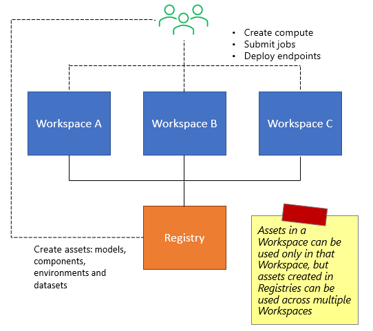
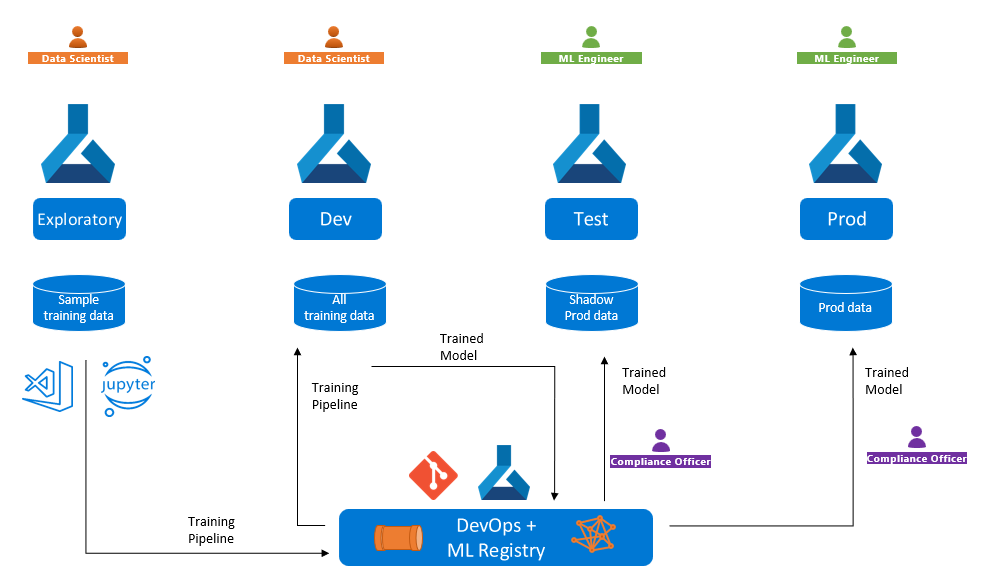
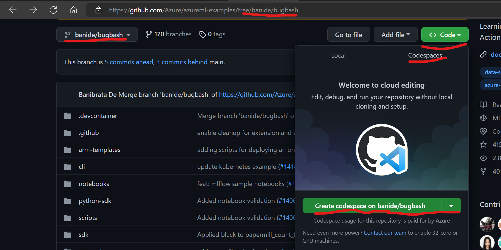
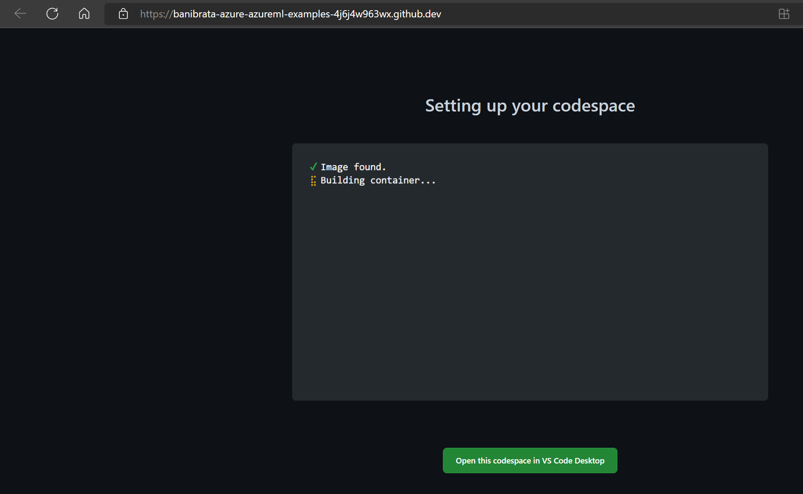
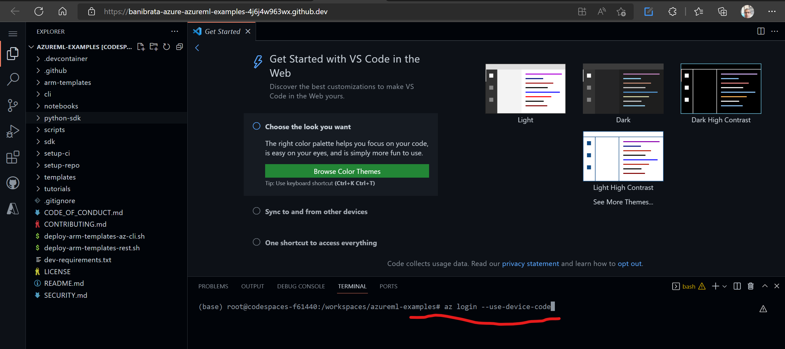

### Welcome

* Request access to Registries preview: https://forms.office.com/r/VrX6rE2Ut0
* Template to report bugs, issues, feature requests: https://github.com/Azure/azureml-previews/issues/new?assignees=ManojBableshwar&labels=registries&template=registries-bug.md&title=Registries+bug%3A+  - GitHub issues (not emails) are the preferred medium for reporting issues, getting support, and sharing feedback.


### What are AzureML Registries?  





Registries are org wide repositories of ML assets such as Models, Environments, Components and more. Registries enable seamless MLOps across different IT environments such as dev, test and prod. Using Registries, Ops professionals can promote a ML model from the dev environment in which Data Scientists trained the model, to test environments in which, let’s say AB testing is done, and finally to production environment, while tracking linage across the ML lifecycle. Real-world ML models are complex and come with scaffolding code to run them. For example, a batch inference scenario that needs a ML model to score on, conda environments and custom docker image for the dependencies, and a pipeline of ML tasks to pre-process the data before scoring. Registries let you package all these – the models, pipelines, and environments – into a cohesive collection and deploy across many AzureML Workspaces in different Azure subscriptions in your organization. 

Data science teams get started with Machine Learning on Azure by creating a AzureML Workspace. Workspace offers a central location to organize and track ML activates - experiments, compute, datasets, models, endpoints, environments and more. A workspace is typically used by one or few teams and is associated with an Azure subscription. From an operations standpoint, keeping security, compliance and cost management in mind, customers typically isolate dev environments and prod environments in different Azure subscriptions, with corresponding AzureML workspaces. Today, you cannot deploy a model registered in one workspace into a different workspace or use pipelines published to one workspace in a different one. This makes MLOps hard and fragile because ML assets created by data science teams in dev workspaces in dev subscriptions must be manually copied over to prod workspaces in prod subscriptions. Sure, you can automate the copy tasks using a DevOps systems but more importantly, you lose lineage and traceability when you move assets across workspaces today – What dataset was used to train a model? Which was the experiment and what were the metrics to show this model was a good candidate? Where do I go to retrain this production model because I see that the performance is degrading? 

Registries, much like a Git repository, decouples ML assets from workspaces and hosts them in a central location, making them available to all workspaces in your organization. You start by iterating within a workspace and when you have a good candidate asset, you can publish it to a Registry in the say way you would register a model or a pipeline with a workspace. Meaning, you use the same `az ml` cli commands to publish assets to either a workspace or a Registry. You can even promote an asset already registered in a workspace to a Registry. Just like assets in a workspace are versioned, assets in Registries support versioning too. This means a model in a Registry can have different versions with a newer version deployed for AB testing to an endpoint in a test workspace while an older and stable continues to be deployed to an endpoint in the production workspace. With online endpoints v2, even after you deploy a new version to production, you can gradually shift traffic from the older to the newer version, keeping a margin of safety. Across this entire flow, the Models UI in Registries will visualize the complete lifecycle of this model – the dataset used to train the model, the job that trained the model with metrics, the various dev, test and prod endpoints to which the model is deployed across different workspaces. 
Registries not only enable better MLOps, but also foster great collaboration with your organization. The Registries UI in AzureML Studio offers gallery to discover all ML assets in your organization. It aggregates assets across multiple org level Registries and smartly curates content such as the most popular assets, most used assets, assets featured by the admins and more, opening up creative collaboration opportunities: Has someone already built a utility component to extract and featurize data from the inventory database? Has someone already downloaded and tokenized Enron Email dataset in our org? Is there a component that warps the latest release of TenserFlow 2.0 and are the any jobs to show how this works? In addition to sharing assets within the enterprise, Registries also enables a framework for public sharing of AzureML compatible ML assets. To begin with, Microsoft will publish a set of valuable utilities and popular per-trained models that will be made available to all AzureML users. In future, we will enable our partners and customers to share assets publicly outside their organization. 

To summarize,

* Registry is a collection of AzureML Assets that can be used by one or more Workspaces.
* Registries facilitate sharing of assets among teams working across multiple Workspaces in an organization.
Registries, by virtue of sharing assets, enable MLOps flow of assets across dev -> test -> prod environments.
* Registries can make Workspaces more project centric by decoupling iterative assets in Workspaces and final/prod ready assets in Registries.
* Assets in Registries can be used by Workspaces in any region (specified while creating the a Registry), with the service transparently replicating necessary resources (code snapshots, docker images) in the background.




### Registry Concepts

#### ARM Representation  

AzureML Registries are Azure Resources that can be managed using Azure Resource Manager (ARM), under the `Microsoft.MachineLearningServices` resource provider. This implies:
* A Registry is placed under a Azure Resource Group
* A Registry is associated with a Azure Subscription that is used to bill resources consumed by the Registry
* In addition to the `microsoft.machinelearningservices/registries` core resource type, creating a Registry creates additional Azure resources such as storage accounts and Azure Container Registries.

#### Replication
Registries are supposed to enable org wide (tenant level) sharing of assets. As such, users can create jobs and endpoints using Registry assets in workspaces if different Azure regions. A Registry can replicate assets to multiple regions ensuring that Workspaces in different regions have low latency access to assets content (code, binaries, docker images, etc.) The regions to which a Registry replicates assets is defined when the Registry is created and can also be updated at a later point. Using assets from a Registry in a Workspace that is in a Region to which the Registry has not been configured to replicate assets will result in an error. 

#### Access control 
Registry permissions will be governed by RBAC, allowing teams to have flexibility between highly curated (tight permissions) vs everyone can contribute (lose permissions). 
* Write access that allows users to create assets in Registry and Manage access that allows users to edit Registry properties is always configured through RBAC.
* Read access allows users to create jobs and endpoints in Workspaces that use assets from a Registry can either be set to i) Tenant level access - all users in a tenant can access the Registry ii) RBAC level access - users granted access to RBAC will be able to use assets from the Registry. 

Currently, a Workspace does not need any permission grant or configuration to use assets from a Registry as long as the user submitting the job as permissions to read assets from the Registry. We may revisit this in future if we discover a need for users to lock down a Workspace and prevent it from using assets outside the Workspace.

For Registry specific RBAC permissions, see https://docs.microsoft.com/en-us/azure/role-based-access-control/resource-provider-operations#microsoftmachinelearningservices. 

Action | Description
--|--
Microsoft.MachineLearningServices/registries/read	| Gets the Machine Learning Services Registry(ies)
Microsoft.MachineLearningServices/registries/write |	Creates or updates the Machine Learning Services Registry(ies)
Microsoft.MachineLearningServices/registries/delete	| Deletes the Machine Learning Services Registry(ies)
Microsoft.MachineLearningServices/registries/assets/read |	Reads assets in Machine Learning Services Registry(ies)
Microsoft.MachineLearningServices/registries/assets/write	| Creates or updates assets in Machine Learning Services Registry(ies)
Microsoft.MachineLearningServices/registries/assets/delete |	Deletes assets in Machine Learning Services Registry(ies)
Microsoft.MachineLearningServices/registries/checkNameAvailability/read	| Checks name for Machine Learning Services Registry(ies)


#### Comparision to Workspace
* Assets created in a Workspace can be used only in that specific Workspace but assets created in a Registry can be used in any Workspace in that tenant. 
* Assets created in a Workspace are referenced as `azureml:<assetname>:<assetversion>` in AzureML CLI V2 YAML. Assets created in a Registry are referenced as `azureml://registries/<registry_name>/<asset_type>/<asset_name>/versions/<asset_version>` when they need to be used in a Workspace. 
* You can browse Assets created in a Workspace in a the AzureML Studio Workspace UI (Components, Environments, Models, Datasets hubs) where as Assets created in a Registry are available for browsing in the AzureML Studio Registries hub in the global home page (ml.azure.com/home).


### Preview Pre-requisites

There are couple of ways to experience the CLI. Below are the options. We would recommend Option A over Option B, as A is cleaner setup in an isolated docker supported by codespaces. Option B could cause issues depending on the clealiness of you local machine, e.g. conda environments could be corrupted, python could be broken, dangling package version etc. This could cause issues to be logged which are not actual issues related to the features. And you could spend hours to fix your local environment.


#### Option A:

* Go to : https://github.com/Azure/azureml-examples/tree/banide/bugbash

* Create a codespaces on the branch, this will pull the right docker image with right version of pre-release CLI that will be used for bugbash



* It takes about a minute to get the docker running and have the Vscode launched in the browser.



* Once it is launced go to the terminal and setup the az login by running az login --use-device-code




You are all set!!! CLI is installed, Private_features are setup. Make sure you do "az login --use-device-code", and setup the right subscription and resource groups to play with the CLI


#### Option B:
Step 1: Setup your CLI V2 environment as explained here: https://docs.microsoft.com/en-us/azure/machine-learning/how-to-configure-cli?tabs=public (az cli, az ml cli, create and set default workspace, etc.)

Make sure you have set your Azure subscription and defaults for location, resource group and workspace for the Az cli

```
az account set -s <subscription_id> 
az configure --defaults group=<RG> workspace=<WORKSPACE> location=<LOCATION>
```


Step 2: Uninstall the V2 CLI (you will install private version in next step)

```
az extension remove -n ml
```

Step 3: Install the private CLI as shown below (or the specific private version that was shared with you)

```
az extension add --source https://azuremlsdktestpypi.blob.core.windows.net/wheels/azureml-v2-cli-e2e-test/65104501/ml-0.0.65104501-py3-none-any.whl --pip-extra-index-urls https://azuremlsdktestpypi.azureedge.net/azureml-v2-cli-e2e-test/65104501 --yes
```

Step 4: Enable Private Preview Features
  
Linux
```
export AZURE_ML_CLI_PRIVATE_FEATURES_ENABLED=true
```
Windows Cmd
```
set AZURE_ML_CLI_PRIVATE_FEATURES_ENABLED=true
```
Powershell
```
$env:AZURE_ML_CLI_PRIVATE_FEATURES_ENABLED = 'true'
```


### How to create an AzureML Registry?

Currently, you need to use an [ARM template](./arm/README.md) to create a Registry. We will support creating Registries using CLI and UI in future. 

### What assets can I create in a Registry?

Today
* Environments
* Components
* Models

In future:
* Data (MLTable and File Data) 

### How to create assets in a Registry? 

You use the same `az ml <asset_type> create` commands available with AzureML CLI V2 with an additional parameter `--registry-name`.

We will add support for Python SDK and UI in future. 

#### Example - Command component 
Start here to learn more about Components and Pipelines: https://docs.microsoft.com/en-us/azure/machine-learning/how-to-create-component-pipelines-cli

Create a file `component.yml` using the contents shown below

```yaml
name: awesome_component
version: 101
type: command
command: echo 'I live in Registry and run in Workspace'
environment:
  image: docker.io/python
```
Create the component
```
az ml component create --file component.yml --registry-name <registry_name_placeholder>
```

#### Example - Environment  
See this doc to learn more about AzureML Environments: https://docs.microsoft.com/en-us/azure/machine-learning/how-to-manage-environments-v2

Create a conda definition file `conda.yml` using contents shown below
```
name: model-env
channels:
  - conda-forge
dependencies:
  - python=3.7
  - numpy=1.21.2
  - pip=21.2.4
  - scikit-learn=0.24.2
  - scipy=1.7.1
  - pip:
    - azureml-defaults==1.38.0
    - joblib==1.0.1
```

Create an environment definition file `env.yml` (refers the conda file created above) using the content shown below
```
name: sklearn_env
version: 99
conda_file: ./conda.yml
image: mcr.microsoft.com/azureml/openmpi3.1.2-ubuntu18.04:20210727.v1
```
Create the environment

```
az ml environment create --file env.yml --registry-name <registry_name_placeholder>
```
#### Example - Model
Learn more about working with Models in AzureML here: https://docs.microsoft.com/en-us/azure/machine-learning/how-to-manage-models

Make sure you have the model file available in the [model dir](./model/) directory in this repo.

Create the model definition file `model.yml` using the content shown below
```
name: sklearn_model
version: 99
path: ./model
```
Create the model
```
az ml model create --file model.yml --registry-name <registry_name_placeholder>
```

### How to view assets created in Registries? 

#### View with CLI

You can list assets using the CLI
```
az ml <asset_type> list --registry-name <registry_name_placeholder>
# list components
az ml component list --registry-name <registry_name_placeholder>
# list environments
az ml environment list --registry-name <registry_name_placeholder>
# list models
az ml model list --registry-name <registry_name_placeholder>
```

You can show a specific asset using the CLI
```
az ml <asset_type> show --name <asset_name> --version <asset_version> --registry-name <registry_name_placeholder>
```

#### View in AzureML Studio 
The Registries UI hub is located in the AzureML global homepage: ml.azure.com/home. For the time-being you may need to use append a flight to the URL: https://ml.azure.com/registries?flight=GlobalRegistries 


### How to use assets from a Registry?

You use assets from Registries in Jobs and Endpoints created in Workspaces. To do so, the asset name needs a Registry scope qualifier, hence the name of assets living in Workspaces looks like this: 

```
azureml://registries/<registry_name>/<asset_type>/<asset_name>/versions/<asset_version>
```

You can find the fully formed name string on the asset details page in the UI


#### Example - Jobs using CLI - Pipeline job that uses the Command Component created above
Start here to learn about Jobs in AzureML: https://docs.microsoft.com/en-us/azure/machine-learning/how-to-train-cli

Create the pipeline job definition `pipeline.yml` using the content shown below
```yaml
type: pipeline
jobs:
  awesome_job:
    type: command
    component: azureml://registries/<registry_name_placeholder>/components/awesome_component/versions/101
    compute: azureml:cpu-cluster
```
Submit the pipeline job
```
az ml job create --file pipeline.yml
```


#### Example - Jobs using Python SDK 
<todo: jobs with Python SDK>

#### Example - Jobs using drag-n-drop Designer UI in AzureML Studio 

Open the Designer in AzureML Studio with flight=registryAsset appended to the url. 

You can then filter assets from a specific Registry and then drag and drop them to the Designer canvas to submit jobs.


#### Example - Deploy a Model to Online Endpoint and submit a scoring request
If you don't know what are managed online endpoints, start here: https://docs.microsoft.com/en-us/azure/machine-learning/how-to-deploy-managed-online-endpoints

Create a online endpoint (we suffix a random number to avoid name clash. This works only on linux. Replace with a random number in Windows)
```
ep_name=testep$RANDOM
az ml online-endpoint create --name $ep_name
```
Create the online deployment definition `deploy.yml` referencing the `model` and `environment` created above. Make sure you have the `score.py` in the `score` directory available in the [score](./score/) directory in this repo. Remember to replace `<registry_name_placeholder>` with the name of your Registry.
```
$schema: https://azuremlschemas.azureedge.net/latest/managedOnlineDeployment.schema.json
name: blue
model: azureml://registries/<registry_name_placeholder>/models/sklearn_model/versions/99
code_configuration:
  code: ./score
  scoring_script: score.py
environment: azureml://registries/<registry_name_placeholder>/environments/sklearn_env/versions/99
instance_type: Standard_DS2_v2
instance_count: 1
```
Deploy the model (you will need the endpoint name created above)
```
az ml online-deployment create --file deploy.yml --endpoint-name  $ep_name --all-traffic
```

Create a scoring request (you will need the name of the endpoint saved in the `ep_name` variable)
```
ENDPOINT_KEY=$(az ml online-endpoint get-credentials -n $ep_name -o tsv --query primaryKey)
SCORING_URI=$(az ml online-endpoint show -n $ep_name -o tsv --query scoring_uri)
curl --request POST "$SCORING_URI" --header "Authorization: Bearer $ENDPOINT_KEY" --header 'Content-Type: application/json' --data @./request/sample-request.json
```
#### Example - Deploy Models using AzureML Studio UI 

<todo: model deployment using UI>

### I get the concepts, show me and end-to-end sample...

You can try the samples in AzureML examples repo: https://github.com/Azure/azureml-examples.git


Clone repo and navigate to sample registry
```
git clone https://github.com/Azure/azureml-examples.git

cd azureml-examples/cli/jobs/pipelines-with-components/nyc_taxi_data_regression

```

Create components in Registry. Replace ContosoMLjun14 with your registry name in below commands. Note that we are setting the environment on the cli from different Registry because curated environments are not yet supported in Registry. This limitation will be addressed shortly. 

```
 az ml component create --file prep.yml --query name -o tsv --registry-name ContosoMLjun14 --set environment=azureml://registries/CuratedRegistry/environments/AzureML-sklearn-0.24-ubuntu18.04-py37-cpu/versions/35 

 az ml component create --file transform.yml --registry-name ContosoMLjun14 --set environment=azureml://registries/CuratedRegistry/environments/AzureML-sklearn-0.24-ubuntu18.04-py37-cpu/versions/35

 az ml component create --file train.yml --registry-name ContosoMLjun14 --set environment=azureml://registries/CuratedRegistry/environments/AzureML-sklearn-0.24-ubuntu18.04-py37-cpu/versions/35 

 az ml component create --file score.yml --registry-name ContosoMLjun14 --set environment=azureml://registries/CuratedRegistry/environments/AzureML-sklearn-0.24-ubuntu18.04-py37-cpu/versions/35 

 az ml component create --file predict.yml --registry-name ContosoMLjun14 --set environment=azureml://registries/CuratedRegistry/environments/AzureML-sklearn-0.24-ubuntu18.04-py37-cpu/versions/35 

```

Query the Registry to check for the registered Components. 
```
# az ml component list --registry-name ContosoMLjun14 --query [].id
[
  "azureml://registries/ContosoMLjun14/components/predict_taxi_fares",
  "azureml://registries/ContosoMLjun14/components/score_model",
  "azureml://registries/ContosoMLjun14/components/train_linear_regression_model",
  "azureml://registries/ContosoMLjun14/components/taxi_feature_engineering",
  "azureml://registries/ContosoMLjun14/components/prep_taxi_data",
  "azureml://registries/ContosoMLjun14/components/awesome_component",
  "azureml://registries/ContosoMLjun14/components/hello_python_world"
]

```

Edit the pipeline.yml with components names pointing to assets created in Registry 

Before editing the components use local files:

```
# cat pipeline.yml | grep "component:"
    component: file:./prep.yml
    component: file:./transform.yml
    component: file:./train.yml
    component: file:./predict.yml
    component: file:./score.yml
```

After editing the components refer to registry:

```
# cat pipeline.yml | grep "component:"
    component: azureml://registries/ContosoMLjun14/components/prep_taxi_data
    component: azureml://registries/ContosoMLjun14/components/taxi_feature_engineering
    component: azureml://registries/ContosoMLjun14/components/train_linear_regression_model
    component: azureml://registries/ContosoMLjun14/components/predict_taxi_fares
    component: azureml://registries/ContosoMLjun14/components/score_model
```

Submit the pipeline Job
```
az ml job create --file pipeline.yml 
```

You must be able to verify that the child jobs in the pipeline are using components from Registries in both the output of `az ml job show` and in the UI as explained in the screenshot above.


### Coming soon...
* Update to this doc to show how to create and use Models from Registry
* Python SDK support for assets from Registry
* Curated environment support
* MLflow model support
* Batch Endpoint support


### Appendix

Old preview bits

```
az extension add --source https://azuremlsdktestpypi.blob.core.windows.net/wheels/azureml-v2-cli-e2e-test/64774736/ml-0.0.64774736-py3-none-any.whl --pip-extra-index-urls https://azuremlsdktestpypi.azureedge.net/azureml-v2-cli-e2e-test/64774736 --yes 
```


