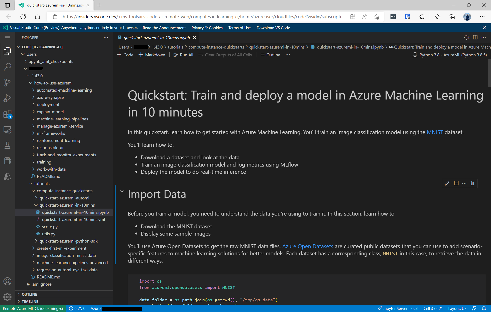

## Overview
[Azure Machine Learning compute instances](https://learn.microsoft.com/en-us/azure/machine-learning/concept-compute-instance) are fully managed cloud-based workstations for data scientists that make it easy to get started with Azure Machine Learning development as well as provide management and enterprise readiness capabilities for IT administrators. Through Visual Studio Code for the Web and the Azure ML Remote Web extension, data scientists can quickly access their compute instances in a full-featured development environment in the browser, where they can explore their files, interact with the terminal, run and debug code, etc. This experience is fully integrated with the [Azure Machine Learning studio](https://ml.azure.com) and you can launch it using the `VS Code Web` entry points listed below.

## Get started
1. Navigate to the [Azure Machine Learning studio](https://ml.azure.com).

2. Invoke the “VS Code Web” link from either the Notebooks or Compute tabs. 
    
    a. [Compute] The VS Code Web link is under the Applications column in the list of your compute instances. 

    

    b. [Notebooks] Click on the "Editors" dropdown and choose the "Edit in VS Code Web" option. 

    

3. A new vscode.dev tab will be open and the Azure Machine Learning – Remote (Web) extension will set up your connection.

## Connecting to compute instances secured using a virtual network
Azure Machine Learning workspaces and its resources (like compute instances) can be secured using virtual networks (VNets). Currently, connecting to compute instances that are behind a virtual network is only supported for VS Code desktop. This will be supported for VS Code for the Web in the future.

Check the [Configure inbound and outbound network traffic](https://learn.microsoft.com/en-us/azure/machine-learning/how-to-access-azureml-behind-firewall) documentation for more details. 

## Known Issues
### The Jupyter extension defaults to system kernel
On the first time connecting to a compute instance, when opening and executing a notebook, the Jupyter extension defaults to `/usr/bin/python3` kernel. Azure ML compute instances come with Python environments that include a wide variety of tools and packages for ML tasks. We recommend manually selecting the interpreter to `Python 3.8 - AzureML (Python 3.8.5)`.

### The Pylance extension shows incorrect IntelliSense errors 
On the first time connecting to a compute instance and opening a notebook we've noticed that Pylance shows multiple IntelliSense errors that shouldn't be shown. We've found that the way to workaround this behavior is to re-select the right kernel, this will clear out the error.

### Azure Machine Learning Extension is not supported on vscode.dev remote connection
Currently the Azure Machine Learning Extension is not supported for web, the team is actively working on making this possible in our next release.

## Contact Us
For VS Code related issues please reach out to vscaiteam@microsoft.com
